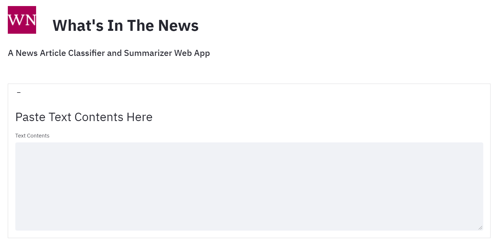
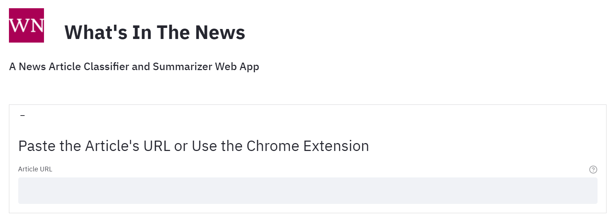
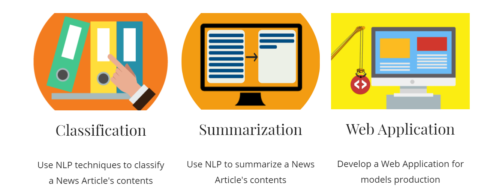
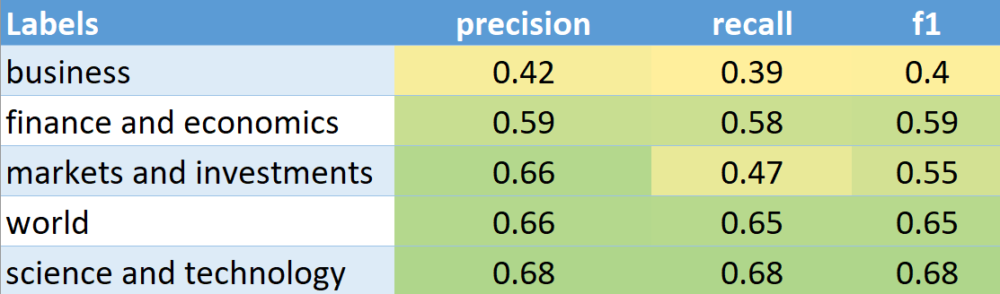
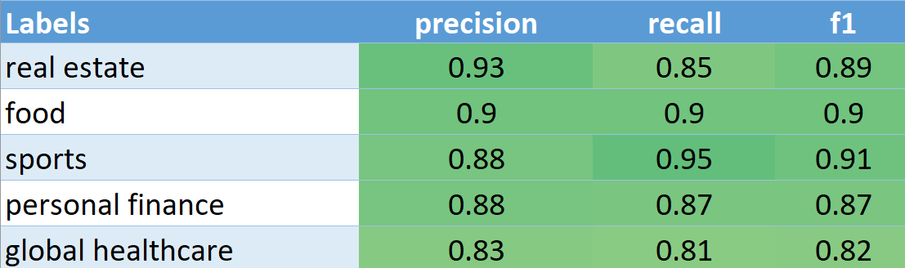
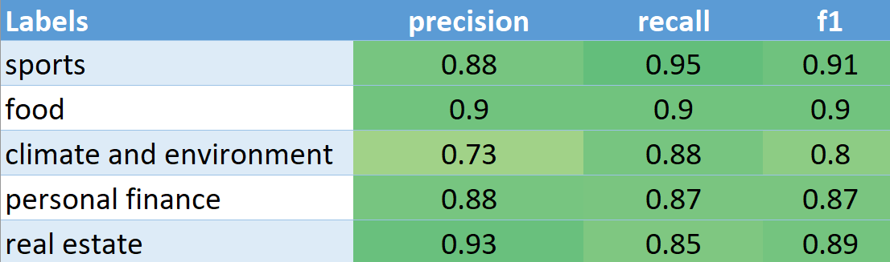

# &nbsp;What's In The News

**A News Article Classifier and Summarizer Web App**

 

## Project Backgound and Motivation

How many news articles can you read in the morning? How long does it take you to read everything? Maybe you don't have much time and simply skim through the headlines? Have you ever thought *"I just wish there is something that can give me a quick summary rundown of all these articles so I can be on top of everything fast"*? Well, those are the same questions that lead me to want an application that could do just that and my drive for creating the *What's In The News* NLP project.

In this project, I used textual data contained within News Articles and used a Data Science approach to dissect those articles. Then, with some NLP-based Machine Learning methods, I built a Machine Learning-based Web application that allows a end-user to make predictions on classifying textual contents of articles and generate short summaries of those articles.

## Project Goals

My goals for this project are to:

## Data Questions

Here are the data questions that I was trying to answer with this project:

1. Given the textual contents of a News Article, can we predict its category?
1. Given the textual contents of a News Article, can we generate a short summary?

## Why This Matter? What's the Value?

Imagine a Document Server within an Organization... In the server, it might look something like this:

Now, you want to find a solution for this mess, right?

- Wouldn't it be great if we can automatically categorized those documents and put in the right folders?
- And while we are at it, can I get a quick idea of what's within those documents without looking into each one?

My proposition is to automate these tasks using Machine Learning. **Stay organized + Save time = Save money!**

## Solution

Meet **What's In The App**, a web application that automatically categorize News Article based on its textual contents and generate a short summary.

In order to get the textual tokens, I used **TF-IDF** vectorizer.

For the classification problem, I tested and trained 6 different models:

- Random Forest
- Multinomial Logistic Regression
- K-Nearest Neighbors
- Decision Tree
- Gaussian Naïve Bayes
- Support Vector Classifier

For the Summarization problem, I tested 2 pre-trained models:

- Pegasus Abstractive Summarization
- Text-To-Text Transfer Transformer (T5)

### Findings and Results

**73%** was the best accuracy I got from the classification model using **Multinomial Logistic Regression**, which is the final model I have in production.

#### Broader and overlapping categories have lower scores

#### More specific categories yield better score

For the summarization part:

- Pegasus uses abstractive summarization: In some test cases, it failed badly.
- T5 resulted in more solid, concrete, and understandable summaries.

I chose T5 as the final model in production.

## Datasets

This is the list of datasets I used for the model training part of this project.

### [All The News 2.1](https://components.one/datasets/all-the-news-2-news-articles-dataset/)

The primary dataset used in this project consists of news articles from the `All The News 2.1` dataset. As raw, this dataset contains 2.7 million news articles and essays from 27 distinct American publishers. However, after applying cleanups on it, I ended up with slightly lower than 2.6 million news articles from 26 distinct American publishers. The articles from this dataset mostly span from 2013 to early 2020. However, after applying the preliminaries data cleaning, we end up with a range of 2016-2020.

In the end, I only ended up using **68k subset of random samples from 2018-2020, stratified over the categories (labels).**

**Disclaimer: This project is for non-commercial and research purposes only. All rights, including copyright, in the content of the original articles are owned by the original owners. Original Data Collection by Components.**

This dataset includes the following columns:

- `date` - Date of publication of the article
- `author` - Author of the article
- `title` - Title of the article
- `article` - Textual content of the article
- `url` - URL of the article (For some)
- `section` - The section category of the news article (For some)
- `publication` - The publisher of the news article

### [BBC News Datasets](http://mlg.ucd.ie/datasets/bbc.html)

Additionally, I used these smaller BBC datasets, purely for discovery purposes. This set consists of two news article datasets, originating from BBC News from 2004-2005. The datasets used for this project are the raw `txt` files, not the pre-processed datasets.

**Disclaimer: This project is for non-commercial and research purposes only. All rights, including copyright, in the content of the original articles are owned by the original owners. Original Data Collection by D. Greene and P. Cunningham. Publication: D. Greene and P. Cunningham. "Practical Solutions to the Problem of Diagonal Dominance in Kernel Document Clustering", Proc. ICML 2006.**

- `BBC` Dataset: Consists of 2225 documents from the BBC news website corresponding to stories in five topical areas:
  - Business
  - Entertainment
  - Politics
  - Sport
  - Tech
- `BBC Sport` Dataset: Consists of 737 documents from the BBC Sport website corresponding to sports news articles in five topical areas
  - Athletics
  - Cricket
  - Football
  - Rugby
  - Tennis

## Technologies Used

- Python + JavaScript
- Jupyter Notebook
- Visual Studio Code
- Streamlit
- Google Chrome Extension
- Azure Machine Learning Services
- Azure Virtual Machine
- AWS EC2
